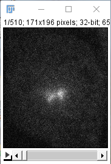

# ijmshow
A MATLAB function. A wrapper of `net.imagej.matlab.ImageJMATLABCommands.show()` (or `IJM.show()`) to support opening a MATLAB array as 5D hyperstack in ImageJ


## Running ImageJ within MATLAB

https://imagej.net/MATLAB_Scripting#Running_ImageJ_within_MATLAB


ImageJ-MATLAB at part of Fiji installation allows us to open an ImageJ instance from within MATLAB and we can transfer an array of  data using `IJM.show('name')` (from MATLAB to ImageJ) and `IJM.getDataset()` and `IJM.getDatasetAs('name')`(from ImageJ to MATLAB).

Although these are useful, the current version of ImageJ-MATLAB's  ``IJM.show('name')` has the following limitations:

1. `IJM.show('name')` will flip over the X and Y axes of array between MATLAB and ImageJ
2. `IJM.show('name')` cannot handle multidimensional (>2D) images properly; All the third and higher dimensions are piled as the fifth dimension of a 5D hyperstack. This is a real pain if you are handling more than one channel, one slice, or one frame of images, as is often the case.
3. No matter what data type the original MATLAB array is, it is shown in ImageJ as `int32` data type. Conversion of the datatype to bytes (`uint8`) or short ( `uint16`) in ImageJ can involve scaling of numeric values, resulting in unexpected changes of pixel values, unless carefully avoided.

`ijmshow` is a wrapper of  `net.imagej.matlab.ImageJMATLABCommands.show()` (or `IJM.show()`) and offers solutions to the above issues. Until someone can fix the `IJM.show()` properly some day, `ijmshow` will be useful for interaction between MATLAB and ImageJ.


## Syntax

```matlab
imp = ijmshow(I)
imp = ijmshow(I,dimorder)
imp = ijmshow(____,'Param',value)

% Param can be 'NewName' or 'FrameInterval'
```


## Examples


### RGB image

```matlab
addpath '/Applications/Fiji.app/scripts'
ImageJ

I = imread('peppers.png')

IJM.show('I') 
```

This will end up X and Y flipped over, and channels are not recognized as channels (instead, it is interpreted as time frames).


```matlab
imp = ijmshow(I)
imp = ijmshow(I,'YXC') % equivalent as above
imp = ijmshow(I,'YXCZT') % equivalent as above
```


### 5D hyperstack


```matlab
imp = IJ.openImage("http://imagej.nih.gov/ij/images/Spindly-GFP.zip");
imp.show();
```


```matlab
IJM.getDatasetAs('I');

size(I) % 171   196     2     5    51
%Note X and Y are now flipped over by IJM.getDatasetAs('I');

IJM.show('I') 
imp2 = ij.IJ.getImage()
```
`IJM.show()` will flip X and Y again, so back to normal X and Y.  However, 2 channels (C), 5 slices (Z) and 51 frames (T) are all piled in the fifth dimension as 510 time frames (T).




```
imp2 =
img["" (-1120), 32-bit, 171x196x1x1x510]
```


```matlab
imp3 = ijmshow(I,'XYCZT')
```

 `'XYCZT'` will accept the flipped over X and Y as input. Now it is shown as 2 channels (C), 5 slices (Z) and 51 frames (T) as expected. The image looks brighter because of the difference in `DisplayRange` setting, but the numeric values were identical to the original.


```
imp3 =
img["" (-1124), 32-bit, 171x196x2x5x51]
```


### `ijmshow_test`

This is a `matlab.unittest.TestCase` subclass and verify the numeric values and dimensions of the `ImagePlus` objects in ImageJ opened by `ijmshow`.


### Contacts

Kouichi C. Nakamura, Ph.D.

kouichi.c.nakamura@gmail.com

MRC Brain Network Dynamics Unit, Department of Pharmacology, University of Oxford

